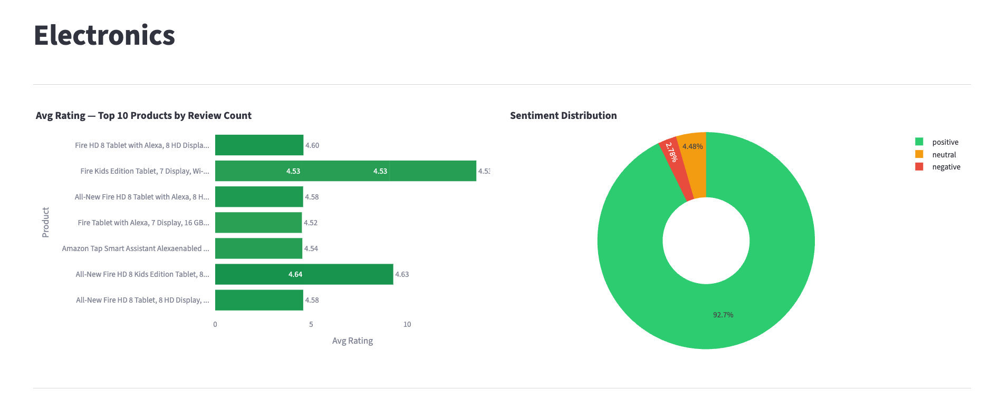

# Automated Customer Review Analysis

[](https://github.com/chandlershortlidge/project-dsai-business-case-automated-customer-reviews/actions/workflows/test.yml)

An NLP pipeline that classifies Amazon product review sentiment, clusters products into meta-categories, and generates blog-style recommendation articles using generative AI.



🤗 [Model on HuggingFace](https://huggingface.co/c-ram/roberta-amazon-reviews-sentiment)

## Project Overview

With thousands of reviews spread across multiple platforms, manually analyzing customer feedback is impractical. This project automates the process through three stages:

1. **Sentiment Classification** - Classify reviews as positive, negative, or neutral using a pre-trained RoBERTa transformer model.
2. **Fine-Tuned Sentiment Model** - Fine-tune `roberta-base` on the balanced review dataset to significantly improve classification accuracy (64% → 83%).
3. **Product Category Clustering** - Group products into 6 meta-categories. Initial attempts with SentenceTransformer embeddings and K-Means produced poor clusters, so a local LLM (Ollama / Qwen 2.5) was used to classify products instead.
4. **Blog Post Generation** - Summarize reviews into recommendation articles for each category using a local LLM (Ollama / Qwen 2.5).

## Dataset

- **Source**: [Datafiniti Amazon Consumer Reviews](https://www.kaggle.com/datasets/datafiniti/consumer-reviews-of-amazon-products/data)
- **Size**: 28,332 reviews across 24 columns (ratings, review text, product info, categories, etc.)
- **Balanced subset**: 3,618 reviews (1,206 per sentiment class) used for classification evaluation

## Pipeline

```
Raw Reviews (28,332)
    |
    v
Data Cleaning & Preprocessing
    |
    v
Sentiment Labeling (star ratings -> negative / neutral / positive)
    |
    v
Class Balancing (downsample to 1,206 per class)
    |                                       |
    v                                       v
Sentiment Classification             Category Clustering
(CardiffNLP RoBERTa → 64%)           (SentenceTransformer + KMeans ✗)
    |                                       |
    v                                       v
Fine-Tuning RoBERTa-base             LLM Classification
(3 epochs → 83% accuracy)           (Ollama / Qwen 2.5 ✓)
    |                                       |
    v                                       v
Classification Metrics               6 Meta-Categories
                                            |
                                            v
                                    Blog Post Generation
                                    (Ollama / Qwen 2.5)
                                            |
                                            v
                                    summaries.json
```

## Results

### Sentiment Classification

Model: `cardiffnlp/twitter-roberta-base-sentiment`

| Class    | Precision | Recall | F1-Score |
|----------|-----------|--------|----------|
| Negative | 0.68      | 0.76   | 0.72     |
| Neutral  | 0.53      | 0.26   | 0.35     |
| Positive | 0.65      | 0.91   | 0.76     |
| **Overall Accuracy** | | | **64%** |

### Fine-Tuned Sentiment Classification

Model: `roberta-base` fine-tuned for 3 epochs on the balanced review dataset (70/30 train/test split, batch size 16)

| Class    | Precision | Recall | F1-Score |
|----------|-----------|--------|----------|
| Negative | 0.84      | 0.85   | 0.85     |
| Neutral  | 0.77      | 0.74   | 0.75     |
| Positive | 0.89      | 0.91   | 0.90     |
| **Overall Accuracy** | | | **83%** |

Fine-tuning improved accuracy by **19 percentage points** over the pre-trained model, with the largest gains in neutral recall (26% → 74%) and negative precision (68% → 84%).

### Product Categories

Initial clustering with SentenceTransformer embeddings and K-Means did not produce meaningful groupings. Products were instead classified into 6 meta-categories by the Qwen 2.5 LLM via Ollama:

| Category | Description |
|----------|-------------|
| Health & Beauty | Batteries, personal care, health items |
| Electronics | Audio, video, smart home, cameras |
| Tablets & E-readers | Fire tablets, Kindle devices |
| Home & Kitchen | Kitchen appliances, storage, accessories |
| Office Supplies | Laptop stands, desk accessories |
| Pet Supplies | Dog crates, cat litter boxes, pet accessories |

### Generated Blog Posts

The pipeline produces category-specific blog articles covering:
- Top 3 products with average ratings and review counts
- Key features, pros, and cons
- Top complaints from reviews
- Worst product in each category and reasons to avoid it

Output is saved to `notebooks/summaries.json`.

## Tech Stack

| Component | Tool |
|-----------|------|
| Data processing | pandas, numpy |
| Visualization | matplotlib, seaborn, plotly |
| Sentiment model (baseline) | `cardiffnlp/twitter-roberta-base-sentiment` (Hugging Face Transformers) |
| Sentiment model (fine-tuned) | `roberta-base` fine-tuned with Hugging Face Trainer |
| Category classification & blog generation | Ollama (Qwen 2.5) |
| Dashboard | Streamlit |
| Evaluation | scikit-learn (classification_report, confusion_matrix) |
| Lint / format / test | ruff, pytest |

> SentenceTransformer + K-Means was tried for category clustering and abandoned — see [Design decisions](#design-decisions) below.

## Project Structure

```
.
├── README.md
├── LICENSE
├── Makefile                              # install / test / lint / app / train
├── pyproject.toml                        # ruff + pytest config
├── requirements.txt
├── app.py                                # Streamlit dashboard entry point
├── review_dashboard.py                   # Pure helpers used by the dashboard
├── src/
│   ├── data.py                           # Loading, cleaning, label assignment, balancing
│   ├── predict.py                        # Baseline sentiment, LLM category classification, blog generation
│   └── train.py                          # RoBERTa fine-tuning (CLI: python -m src.train)
├── tests/
│   ├── fixtures/sample_reviews.csv
│   ├── test_data.py
│   └── test_review_dashboard.py
├── data/
│   └── amazon-customer-reviews/          # Raw CSV files from Kaggle (gitignored)
├── notebooks/
│   ├── main.ipynb                        # Original exploratory pipeline
│   ├── Amazon_Reviews_Fine_Tuning_Roberta_Base.ipynb  # Fine-tuning experiment (Colab)
│   └── summaries.json                    # Generated blog post output
└── .github/workflows/test.yml            # Lint + pytest on push / PR
```

The `src/` modules are the canonical pipeline code; `notebooks/main.ipynb` is the original exploratory pass and remains for reference.

## Setup & Usage

### Prerequisites

- Python 3.13 (the pinned versions in `requirements.txt` were tested here; older Pythons should work but may need adjusted pins)
- [Ollama](https://ollama.com/) installed locally with the Qwen 2.5 model pulled

### Installation

```bash
make install            # pip install -r requirements.txt
ollama pull qwen2.5
```

### Common commands

```bash
make test               # run the pytest suite
make lint               # ruff check
make format             # ruff format (writes changes)
make app                # launch the Streamlit dashboard
make train DATA=path/to/balanced_reviews.csv   # fine-tune RoBERTa
```

### Running the pipeline

1. Download the dataset from [Kaggle](https://www.kaggle.com/datasets/datafiniti/consumer-reviews-of-amazon-products/data) and place the CSV files in `data/amazon-customer-reviews/`.
2. Run `notebooks/main.ipynb` end-to-end (or import from `src/data.py` and `src/predict.py` in your own script). This produces `notebooks/amazon_sentiment_categories.csv` (the labelled dataset the dashboard reads) and `notebooks/summaries.json`.
3. Optional: fine-tune RoBERTa on the balanced dataset with `make train DATA=path/to/balanced_reviews.csv`. The Colab notebook is preserved for the original GPU-backed run.

### Running the dashboard

```bash
make app
```

The dashboard reads `notebooks/amazon_sentiment_categories.csv`, lets you switch between the six meta-categories, and can regenerate any category's blog summary on demand via Ollama. Generated summaries are persisted back to `notebooks/summaries.json`.

## Notebooks

- **main.ipynb** - End-to-end pipeline: data loading, preprocessing, sentiment classification, category clustering, and blog post generation.
- **Amazon_Reviews_Fine_Tuning_Roberta_Base.ipynb** - Fine-tunes `roberta-base` on the balanced review dataset (3,618 reviews, 3 classes) for 3 epochs, achieving 83% accuracy vs 64% from the pre-trained classifier. Run on Google Colab.

## Design decisions

**Why local Ollama + Qwen 2.5 instead of a hosted API.** The reviews aren't actually sensitive, but keeping inference local meant no per-call cost, no data leaving the machine, and direct hands-on with running an open-weight model — which was also a course constraint. The trade-off is throughput: classifying ~28k products one-by-one through a local 7B model is slower than batching against a hosted API, and quality is below frontier models for nuanced summarisation.

**Why fine-tune RoBERTa for sentiment instead of also using the LLM.** Sentiment was approached as a classical classification problem before the LLM was introduced into the stack. Fine-tuning `roberta-base` was the assignment; in hindsight, using Qwen 2.5 zero-shot would have been a reasonable baseline to compare against, and is listed as future work below.

**Why drop K-Means clustering.** SentenceTransformer embeddings + K-Means on product names produced clusters that mixed unrelated products (e.g. tablets with batteries) and split obvious groups across multiple clusters. The K value sweep didn't fix it — the embeddings were too coarse for the granularity wanted. Asking the LLM to assign each product to one of six pre-defined meta-categories produced groupings that matched intuition and matched the original Amazon `categories` column on spot-checks across all six buckets.

**How LLM category assignments were validated.** Cross-referenced against the original Amazon `categories` column on a sample. Not a formal accuracy number — listed as a limitation below.

## Limitations & next steps

- **No held-out test for category classification.** The LLM assignments were spot-checked against Amazon's own category strings, but there's no quantified accuracy. A small hand-labelled sample would give a real number.
- **No LLM baseline for sentiment.** Qwen 2.5 zero-shot wasn't compared against fine-tuned RoBERTa. That comparison would tell you whether the fine-tune was actually worth the training step for this dataset.
- **Single-run fine-tuning.** The 83% accuracy comes from one run with one seed. No cross-validation, no confidence interval.
- **Class imbalance handled by downsampling.** Dropping reviews to balance classes throws away signal. Class weights or focal loss would be the more honest fix.
- **Blog generation is unevaluated.** Output looks reasonable on inspection but there's no rubric or human eval scoring factuality vs. the underlying reviews.
- **No tests.** Helpers in `app.py` (`get_top_n`, `get_worst`, `category_key`) are pure and easy to cover with pytest.
